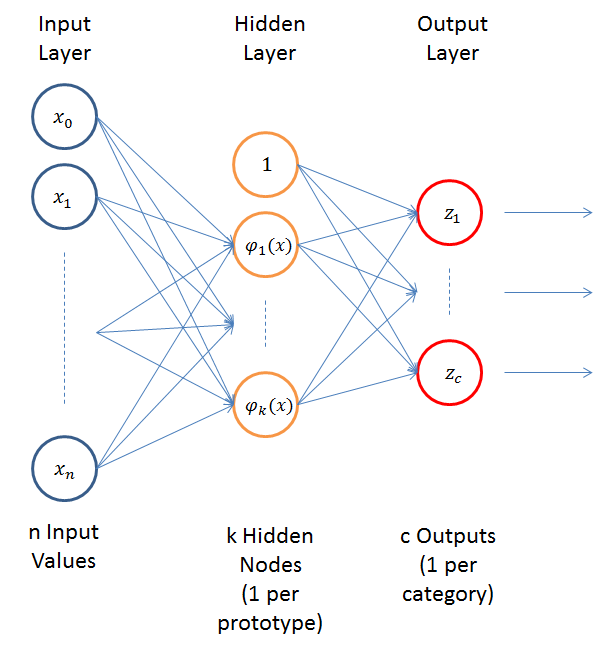

### Basic Ideas of Neural Networks
Single layer perceptron can only solve linearly separable problems. In order to solve nonlinear problems, multilayer perceptron is used. Neural networks are used in supervised and unsupervised learning. 

Radial Basis Function network is a supervised learning architecture. Each hidden node is a RBF function which gives the same activation value for inputs within the same radial distance of the node centre. To select these centers, choose them randomly, use clustering (like Self Organising Map) or supervised selection. As opposed to multilayer perceptron, RBF network can only have one hidden layer, and only the hidden layer is nonlinear while the output layer is linear. 

Reduced Coulomb Energy network is a self growing network for supervised learning, each input node is a feature in the given pattern.

### Reasoning

To achieve good generalisation, use: a large training set when possible, early stopping, fewer hidden layer nodes, dropout, batch normalisation, regularisation.
